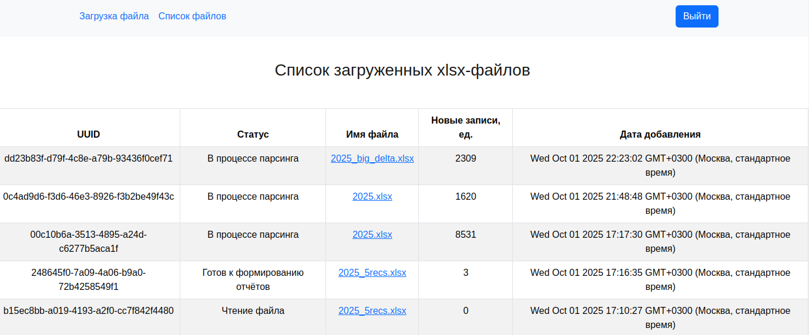
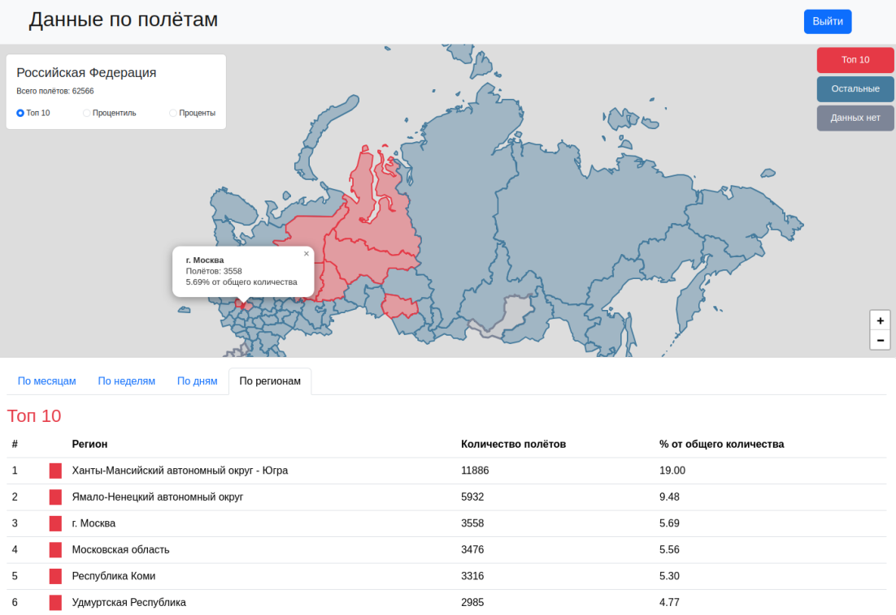
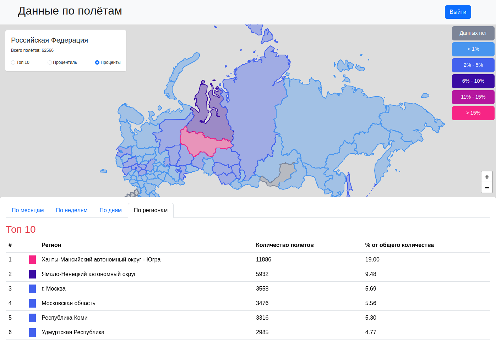
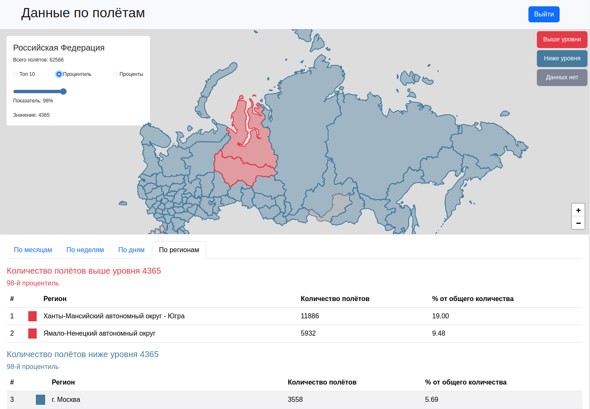
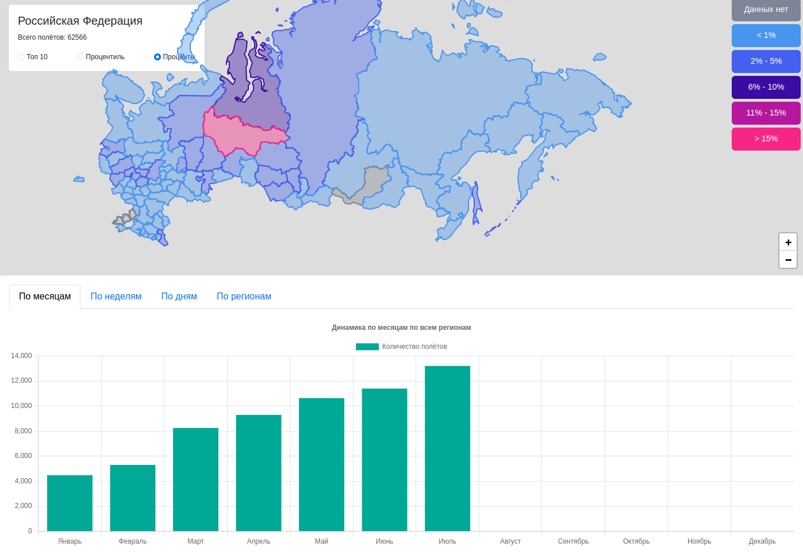
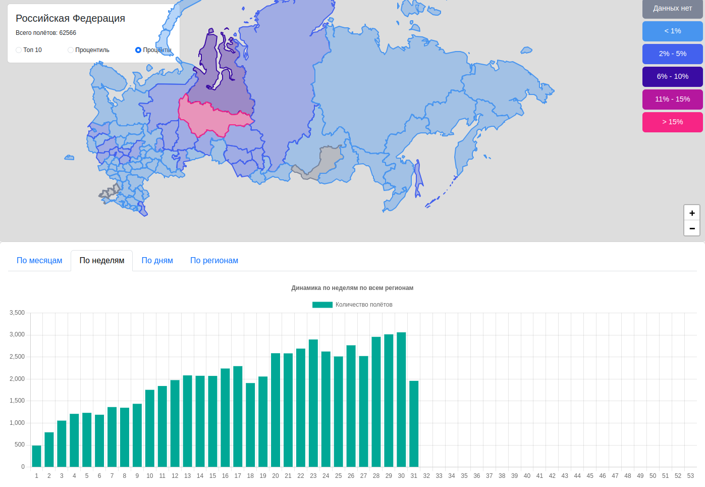
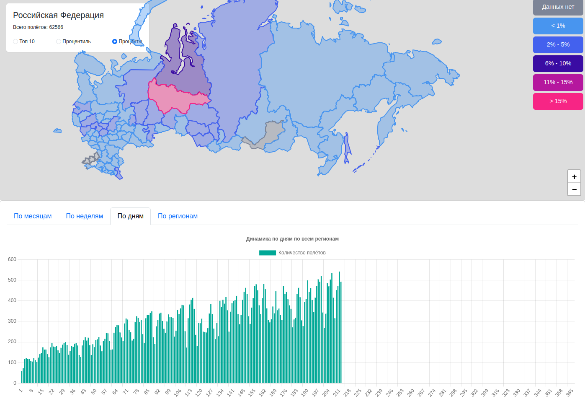

# Информационная система обработки и статистики полётов

> В данном разделее описано текущее состояние информационной системы, а также целевая архитектура, в случае масштабирования.

- 1 [Существующая архитектура информационной системы](#1.)
  - 1.1 [Обработка файлов](#1.1)
  - 1.2 [Файловое хранилище](#1.2)
  - 1.3 [Обработка статусов](#1.3)
  - 1.4 [Брокер сообщений](#1.4)
  - 1.5 [Таблицы](#1.5)
  - 1.6 [Автоматизированное рабочее место (АРМ)](#1.6)
- 2 [Целевая архитектура](#2.)

## 1. Существующая архитектура информационной системы<a id='1.'></a>


_рис.1 Существующая архитектура_

> Администратор входит в свой [АРМ](#1.6), загружает файл для обработки. Далее создается уникальный идентификатор UUID в базе данных АРМ-а, присваивается файлу и файл под данным UUID попадает в [файловое хранилище MinIO](#1.2). UUID отправляется [брокеру сообщений](#1.4), который считывается [обработчиком файлов](#1.1). Обработчик, распарсив файл, сохраняет данные в отчётную базу данных. Данные становятся доступны в [АРМ-е пользователя](#1.6). На каждом шаге происходит изменение [статуса](#1.5) обработки файла.

## 1.1 Обработка файлов<a id='1.1'></a>

> Получает UUID через брокер, по данному идентификатору находит файл в MinIO. Считав файл, производит парсинг и сохраняет данные в БД отчётов. Парсинг происходит посредством поиска координат взлета в колонке DEP и сравнение вхождения данных координат с контуром границ субъекта РФ (используется PostGIS). В качестве проверки существующих данных используется контрольная сумма набора полей ORVD, SHR, DEP, ARR. Во время смены состояния обработки происходит отправка статуса в брокер сообщений.

## 1.2 Файловое хранилище<a id='1.2'></a>

> В качестве файлового хранилища выбрано MinIO — это высокопроизводительный программный сервер объектного хранения с открытым исходным кодом, совместимый с Amazon S3 API, который позволяет хранить и управлять неструктурированными данными, такими как фото, видео, различные документы в виде файлов.
> Все объекты находятся в одном «каталоге» – bucket.

Наименование автоматически созданного bucket:

```
fly-telegraph
```

## 1.3 Обработка статусов<a id='1.3'></a>

Статусы передаются через брокер сообщений. Данный обработчик фиксирует статус и по UUID производит обновление состояния в БД АРМ-а.

## 1.4 Брокер сообщений<a id='1.4'></a>

> Kafka — это распределённый программный брокер сообщений, выступающий в роли посредника для асинхронной коммуникации между различными приложениями и сервисами, особенно в системах, обрабатывающих большие потоки данных в реальном времени. Он принимает сообщения от отправителей (продюсеров), сохраняет их в распределенном хранилище (топиках), а затем предоставляет эти сообщения потребителям (консьюмерам) по запросу.

### Настройки для внешних приложений

Для отправки сообщения:

```
KAFKA_BROKER=localhost:9092
KAFKA_TOPIC=topic-fly-status
```

Для чтения сообщений:

```
KAFKA_BROKER=localhost:9092
KAFKA_TOPIC=topic-fly-status
KAFKA_GROUP=topic-group-fly-status
```

### Топики

| Наименование           | Описание                                   | Формат                                                                   |
| ---------------------- | ------------------------------------------ | ------------------------------------------------------------------------ |
| topic-fly-status       | Передача статусов                          | { uuid: UUID, status: statusCode }                                       |
| topic-fly-file         | Передача наименований файлов для обработки | { uuid: UUID }                                                           |
| \* topic-fly-file-line | Передача строк файла для обработки         | { uuid: UUID, rownum: rownum, orvd: orvd, shr: shr, dep: dep, arr: arr } |

\* топик для целевой архитектуры, при масштабировании системы (в существующей версии не испоьзуется)

uuid - сквозной идентификатор (см. поле таблицы xlsxfiles в fly-db)
statusCode - статусы xlsxfiles (см. fly-db)
rownum - порядковый номер строки в xlsx
orvd, shr, dep, arr - колонки в xlsx

## 1.5 Таблицы<a id='1.5'></a>

### Информация загруженных файлов: xlsxfiles

| Наименование | Тип поля  | Описание                                                                                                       |
| ------------ | --------- | -------------------------------------------------------------------------------------------------------------- |
| id           | INT       | Уникальный идентификатор в данной таблице                                                                      |
| uuid         | UUID      | Уникальный идентификатор файла. Используется в качестве сквозного идентификатора и названия файла в хранилище. |
| statusCode   | VARCHAR   | Статус обработки                                                                                               |
| bucket       | VARCHAR   | Используется в хранилище для объединения файлов (аналог папки)                                                 |
| originalName | VARCHAR   | Оригинальное название файла                                                                                    |
| originalSize | INT       | Размер оригинального файла                                                                                     |
| createdAt    | TIMESTAMP | Дата загрузки файла в систему                                                                                  |
| updatedAt    | TIMESTAMP | Дата обновления информации                                                                                     |

### Статусы xlsxfiles

| status_code | Имя                          | Описание                                             |
| ----------- | ---------------------------- | ---------------------------------------------------- |
| uploaded    | Готов к обработке            | Ожидает чтения Обработчиком файла                    |
| reading     | Чтение файла                 | Файл читается обработчиком для подготовки к парсингу |
| \* readed   | Готов к парсингу             | Ожидает процесс парсинга каждого поля                |
| parsing     | В процессе парсинга          | Происходит процесс парсинга каждого поля             |
| \* parsed   | Готов к сохранению           | Ожидает/происходит процесс сохранения каждого поля   |
| \* saving   | В процессе сохранения        | Происходит процесс сохранения каждого поля           |
| saved       | Готов к формированию отчётов | Все поля обработаны и сохранены в отчётной БД        |

\* статусы для целевой архитектуры, при масштабировании системы (в существующей версии не испоьзуются)

### Субъекты РФ: regions

| Наименование     | Тип поля | Описание                                  |
| ---------------- | -------- | ----------------------------------------- |
| id               | INT      | Уникальный идентификатор в данной таблице |
| rus_code         | INT      | Код субъекта                              |
| rus_name         | VARCHAR  | Наименование субъекта                     |
| geometry_geojson | JSONB    | Границы субъекта в формате geojson        |
| geometry_postgis | GEOMETRY | Границы субъекта в формате geometry       |

### ОрВД: orvd

| Наименование | Тип поля | Описание                                  |
| ------------ | -------- | ----------------------------------------- |
| id           | INT      | Уникальный идентификатор в данной таблице |
| name         | VARCHAR  | Наименование                              |

### Полёты: flights

| Наименование   | Тип поля  | Описание                                                                             |
| -------------- | --------- | ------------------------------------------------------------------------------------ |
| id             | INT       | Уникальный идентификатор в данной таблице                                            |
| region_id      | INT       | Идентификатор субъекта                                                               |
| orvd_id        | INT       | Идентификатор ОрВД                                                                   |
| coords_postgis | GEOMETRY  | Координата полёта (используются координаты взлёта)                                   |
| event_date     | DATE      | Дата полёта                                                                          |
| xlsxfile_uuid  | UUID      | Уникальный идентификатор исходного xlsx файла                                        |
| row_num        | INT       | Строка xlsx файла                                                                    |
| details        | JSONB     | Набор полей ORVD, SHR, DEP, ARR в формате json                                       |
| details_SHA256 | VARCHAR   | Контрольная сумма содержания набора полей ORVD, SHR, DEP, ARR телеграфного сообщения |
| createdAt      | TIMESTAMP | Дата загрузки файла в систему                                                        |
| updatedAt      | TIMESTAMP | Дата обновления информации                                                           |

## 1.2 АРМ<a id='1.6'></a>

> Администратор, загрузив файл дял обработки имеет возможность отслеживать статус обработки в реальном времени. Отображается количество найденных записей. Добавление в БД происходит посредством дельт новых записей.


_рис.2 Список добавленных и обработанных файлов_

> Пользователь, зайдя в АРМ, получает возможность просмотра результатов обработки всех загруженных файлов с цветовой индикацией на карте РФ.
> Например, доступен рейтинг Топ 10 регионов, с максимальным количеством полётов.


_рис.3 Топ 10_

> Показатели отдельно взятого субъекта РФ.


_рис.4 Данные субъекта_

> Тепловая карта полётов по регионам.


_рис.5 Проценты_

> Вычисление заданного процентиля позволяет выявить аномалии.


_рис.6 Вычисление процентиля с отображением результата на карте_

> Временные ряды по месяцам.


_рис.7 По месяцам_

> По неделям.


_рис.8 По неделям_

> По дням.


_рис.9 По дням_

# 2. Целевая архитектура<a id='2.'></a>


_рис.10 Целевая архитектура_

> Основное отличие целевой архитектуры состоит в том, чтобы дополнить обработку данных новыми обработчиками (например, если потребуется на определенном шаге транслировать данные дальше в иные информационные системы), а также создать логическую репликацию, для более быстрой выборки данных.
